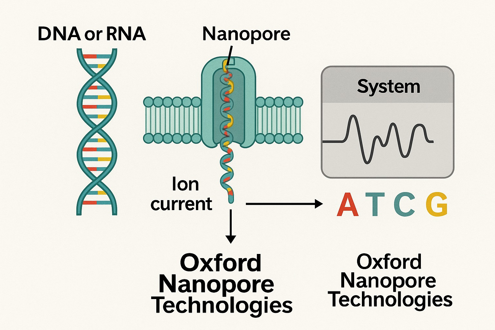
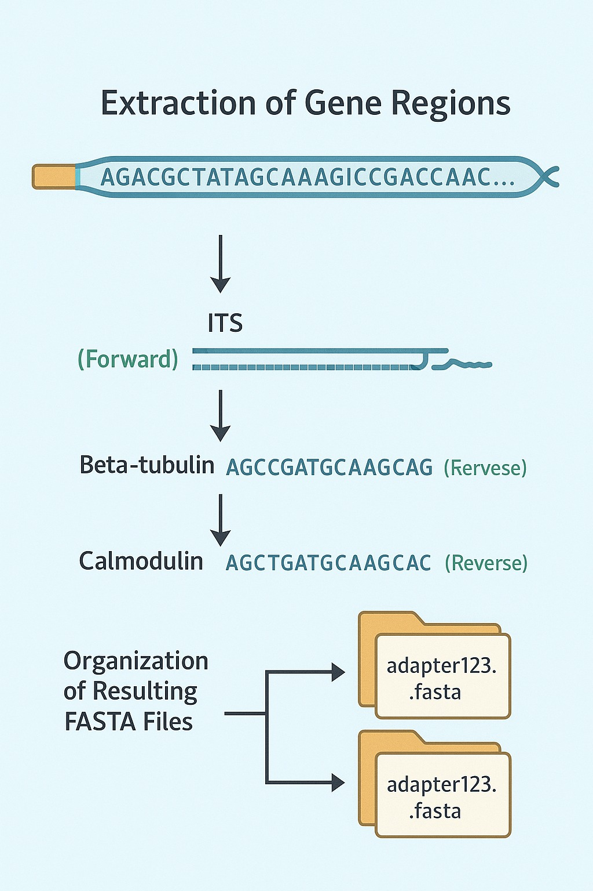

# Trimming-DNA-Sequences-Using-Primers

 

 DNA veya RNA dizilerinin belirlenmesi için kullanılan üçüncü nesil bir sekanslama teknolojisi olan Nanopore sekanslama sistemi Oxford Nanopore Technologies (ONT) tarafından geliştirilmiştir. Nanopore sekanslama, bir nükleik asit zincirinin bir nanopordan geçirilerek dizisinin okunmasını sağlar. Molekül nanopordan geçerken bir iyon akımı oluşur. Her bir nükleotid (A, T, C, G veya U), bu akımı farklı şekilde etkiler. Sistem bu akımdaki değişiklikleri analiz ederek hangi bazın geçtiğini tahmin eder. Çok uzun okuma (long-read) kapasitesi (1 milyon baz ve üzeri) mümkündür.
  

 Sekanslama süreci laboratuvar işlemlerini (wet-lab), ve bilgisayar tabanlı analizleri (dry-lab) kapsar. Kütüphane PCR ‘ı yapılmış olan DNA moleküllerinin uçlarına adaptörler bağlanarak hazırlanır. Flow cell yükleme aşamasından bilgisayara gelen elektrik sinyalleri Guppy veya Bonito gibi basecaller yazılımları kullanılarak FASTQ formatına çevrilir. Bu dosyanın içinde adaptörün bağlanmış olduğu bütün okumalar bulunmaktadır.
  
  

 Bu proje kapsamında Aspergillus türlerinin identifikasyonu için 3 gen bölgesi (ITS, Beta_tubulin, Calmodulin) ile çalışılmaktadır. Bu gen gölgeleri yaklaşık 500-700 bp uzunluğundaki bölgelerdir. Nanopor Sekans Teknolojisi ile ucuna adaptör bağlanan bu uzun okumaların içireisinde bu 3 bölge de bulunmaktadır. Bu kod ile bu okumalar içerisinde kullandığımız primerler forward ve revers olarak bulunup sadece o bölge arasında kalan kısım kesilerek yeni bir .fasta dosyasına aktarılıyor. Bu dosyanın içinde birden fazla forward ve revers primerlerinden bulanabilir. Bunun için her iki primeri de içermeli ve 500-700 bp arasında olmalı kısıtları bu kodda kullanılmıştır. Tüm bu şartları sağlayan .fasta dosyaları içerdiği adaptörün kodu ile klasörlenmektedir. 
  

